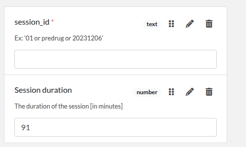

# elabforms
A set of tools to create and manage standardized forms for eLabFTW

## Create a virtual environment
```bash
python3 -m venv myenv
source myenv/bin/activate
```

## Installation
Make sure you have `git` and `pip` installed. You can download and unzip the following repositories:
- git@github.com:INT-NIT/elabforms_INTProjects.git
- git@github.com:INT-NIT/elabforms_BIDSMetadata.git

Or you can clone the repositories using `git`.

### Install dependencies
```bash
pip install fastapi pyyaml uvicorn python-multipart gitpython
```

## User mode
```bash
pip install --index-url https://test.pypi.org/simple/ --extra-index-url https://pypi.org/simple elabforms==0.0.5
```

### Usage
- Test the installation:
  ```bash
  eform --help
  ```
- Create a new form:
  ```bash
  eform liste_template_part.csv template_generated.json
  ```
- Use the GUI:
  ```bash
  uvicorn elabforms.main:app --reload
  ```
  Then go to http://127.0.0.1:8000 and upload `liste_template_part.csv` to create a new form.

## Development mode

### Clone the repository for development
```bash
git clone git@github.com:INT-NIT/elabforms.git
cd elabforms
pip install -r requirements.txt
```

## Usage
```bash
cd elabforms
python generate_templates.py template_file_list.csv template_generated.json
```

## Example
Assuming you have a file `template_file_list.csv` with the following content:
```csv
template_part_Example_1.json
template_part_Example_2.json
```
Then run:
```bash
python generate_templates.py template_file_list.csv template_generated.json
```

This will generate the file `template_generated.json` which will contain the content of the two files concatenated together.


```

 let 's template_part_Example_1.json`  

with content:
```json
{
    "elabftw": {
        "extra_fields_groups": [
            {
                "id": 1,
                "name": "GENERIC_BIDS_SESSION"
            }
        ]
    },
    "extra_fields": {
        "session_id": {
            "type": "text",
            "value": "",
            "group_id": 1,
            "position": 0,
            "required": true,
            "description": "Ex: '01 or predrug or 20231206'"
        },
        "Session duration": {
            "type": "number",
            "value": "",
            "group_id": 1,
            "position": 3,
            "description": "The duration of the session [in minutes]",
            "blank_value_on_duplicate": true
        }
    }
}
```
and `template_part_Example_2.json` ,
with the following content:
```json
{
  "elabftw": {
    "display_main_text": true,
    "extra_fields_groups": [
      {
        "id": 2,
        "name": "Run "
      }
    ]
  },
  "extra_fields": {
    "TaskName": {
      "type": "text",

      "group_id": 2,
      "position": 0,

      "description": "Code name of the task (no space and only alphanumeric characters).\n Ex: 'rest or facesnback or headnodding'"
    },
    "RunNumber": {
      "type": "text",
      "value": "",
      "group_id": 2,
      "position": 2
    },
    "StartTime": {
      "type": "text",
      "value": "",
      "group_id": 2
    },
    "RunComment": {
      "type": "text",
      "value": "",
      "group_id": 2,
      "position": 3,
      "description": "Comment about the subject behavior during the run."
    },
    "TaskDescription": {
      "type": "text",
      "value": "  ",
      "group_id": 2,
      "position": 1,
      "description": "Description of the task"
    }
  }
}
```

This will generate the following file " template_generated.json" ,

which will contain the content of the two files `template_part_Example_1.json` and `template_part_Example_2.json` concatenated together.
```json
{
    "elabftw": {
        "extra_fields_groups": [
            {
                "id": 1,
                "name": "GENERIC_BIDS_SESSION"
            },
            {
                "id": 2,
                "name": "Run "
            }
        ]
    },
    "extra_fields": {
        "session_id": {
            "type": "text",
            "value": "",
            "group_id": 1,
            "position": 0,
            "required": true,
            "description": "Ex: '01 or predrug or 20231206'"
        },
        "Session duration": {
            "type": "number",
            "value": "91",
            "group_id": 1,
            "position": "3",
            "description": "The duration of the session [in minutes]",
            "blank_value_on_duplicate": true
        },
        "TaskName": {
            "type": "text",
            "group_id": 2,
            "position": 0,
            "description": "Code name of the task (no space and only alphanumeric characters).\n Ex: 'rest or facesnback or headnodding'"
        },
        "RunNumber": {
            "type": "text",
            "value": "",
            "group_id": 2,
            "position": 2
        },
        "StartTime": {
            "type": "text",
            "value": "",
            "group_id": 2
        },
        "RunComment": {
            "type": "text",
            "value": "",
            "group_id": 2,
            "position": 3,
            "description": "Comment about the subject behavior during the run."
        },
        "TaskDescription": {
            "type": "text",
            "value": "  ",
            "group_id": 2,
            "position": 1,
            "description": "Description of the task"
        }
    }
}
```bash
