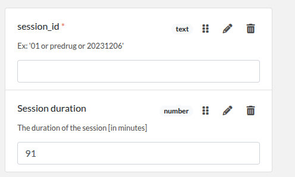

Example
=======

Assuming you have a file `template_file_list.csv` with the following content:

.. code-block:: text

   template_part_Example_1.json
   template_part_Example_2.json

This will generate the file `template_generated.json` which will contain the content of the two files concatenated together.

---

Let’s see the parts:

- `template_part_Example_1.json` (see below)

.. code-block:: json

.. code-block:: json

   {
       "elabftw": {
           "extra_fields_groups": [
               {
                   "id": 1,
                   "name": "GENERIC_BIDS_SESSION"
               }
           ]
       },
       "extra_fields": {
           "session_id": {
               "type": "text",
               "value": "",
               "group_id": 1,
               "position": 0,
               "required": true,
               "description": "Ex: '01 or predrug or 20231206'"
           },
           "Session duration": {
               "type": "number",
               "value": "",
               "group_id": 1,
               "position": 3,
               "description": "The duration of the session [in minutes]",
               "blank_value_on_duplicate": true
           }
       }
   }

- `template_part_Example_2.json` (see `docs/RUN_BIDS.png`)
.. image:: _static/RUN_BIDS.png
   :alt: RUN_BIDS
   :width: 400px

.. code-block:: json

   {
     "elabftw": {
       "display_main_text": true,
       "extra_fields_groups": [
         {
           "id": 2,
           "name": "Run "
         }
       ]
     },
     "extra_fields": {
       "TaskName": {
         "type": "text",
         "group_id": 2,
         "position": 0,
         "description": "Code name of the task (no space and only alphanumeric characters).\n Ex: 'rest or facesnback or headnodding'"
       },
       "RunNumber": {
         "type": "text",
         "value": "",
         "group_id": 2,
         "position": 2
       },
       "StartTime": {
         "type": "text",
         "value": "",
         "group_id": 2
       },
       "RunComment": {
         "type": "text",
         "value": "",
         "group_id": 2,
         "position": 3,
         "description": "Comment about the subject behavior during the run."
       },
       "TaskDescription": {
         "type": "text",
         "value": "  ",
         "group_id": 2,
         "position": 1,
         "description": "Description of the task"
       }
     }
   }

---

This will generate the following file `template_generated.json` (see `docs/template_generated.png`):

- `template_part_Example_2.json` (see `docs/RUN_BIDS.png`)
.. image:: _static/template_generated.png
   :alt: Template_generated
   :width: 400px

.. code-block:: json

   {
       "elabftw": {
           "extra_fields_groups": [
               {
                   "id": 1,
                   "name": "GENERIC_BIDS_SESSION"
               },
               {
                   "id": 2,
                   "name": "Run "
               }
           ]
       },
       "extra_fields": {
           "session_id": {
               "type": "text",
               "value": "",
               "group_id": 1,
               "position": 0,
               "required": true,
               "description": "Ex: '01 or predrug or 20231206'"
           },
           "Session duration": {
               "type": "number",
               "value": "91",
               "group_id": 1,
               "position": "3",
               "description": "The duration of the session [in minutes]",
               "blank_value_on_duplicate": true
           },
           "TaskName": {
               "type": "text",
               "group_id": 2,
               "position": 0,
               "description": "Code name of the task (no space and only alphanumeric characters).\n Ex: 'rest or facesnback or headnodding'"
           },
           "RunNumber": {
               "type": "text",
               "value": "",
               "group_id": 2,
               "position": 2
           },
           "StartTime": {
               "type": "text",
               "value": "",
               "group_id": 2
           },
           "RunComment": {
               "type": "text",
               "value": "",
               "group_id": 2,
               "position": 3,
               "description": "Comment about the subject behavior during the run."
           },
           "TaskDescription": {
               "type": "text",
               "value": "  ",
               "group_id": 2,
               "position": 1,
               "description": "Description of the task"
           }
       }
   }
